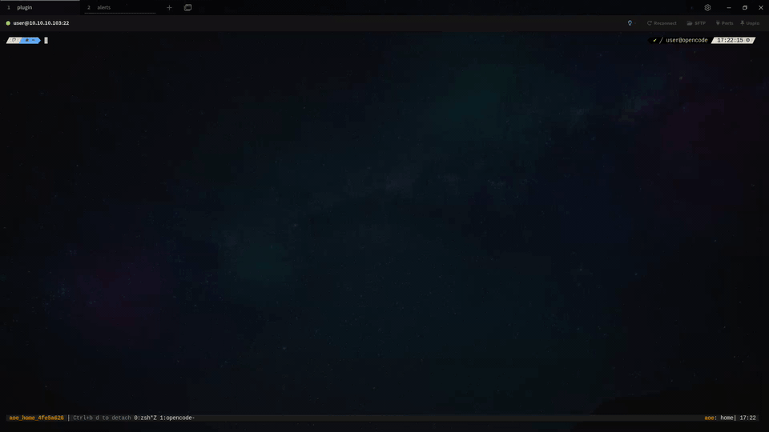

# oc-plugin-the-matrix

Matrix-inspired TUI plugin for OpenCode.

It adds a Matrix-inspired theme with selectable accent colors, toggleable background transparency, animated rain, a cinematic startup intro, and optional session text that briefly drops into place.

## Screencast

[](./screencast.mp4)

Click the preview to open the full video.

## Features

- selectable accent colors: `Green`, `Cyan`, `Blue`, `Purple`, `Amber`, `Yellow`, `Pink`, and `Red`
- toggleable transparent or opaque `matrix-console` theme background
- fullscreen boot-style intro
- Matrix rain on the home screen or across the full UI
- route-aware `adaptive` and `uniform` intensity profiles
- scanline and glow post-processing
- command-palette settings dialog with persisted preferences
- optional session-text settle effect for newly rendered text in sessions

## Install

1. Clone this repository somewhere on your machine.
2. Register it in `~/.config/opencode/tui.json`:

```json
{
  "$schema": "https://opencode.ai/tui.json",
  "plugin": [
    "/absolute/path/to/oc-plugin-the-matrix"
  ]
}
```

3. Start or restart OpenCode.

The plugin installs the bundled `matrix-console` theme and sets it automatically on first load.

## Usage

Open the command palette and run `Matrix rain settings`.

Available commands:

- `Matrix rain settings`
- `Enable Matrix plugin` / `Disable Matrix plugin`
- `Replay Matrix intro`
- `Use matrix-console theme`

## Settings

- `Plugin enabled`: master on/off switch for the Matrix theme and effects
- `Accent color`: switch between `Green`, `Cyan`, `Blue`, `Purple`, `Amber`, `Yellow`, `Pink`, and `Red`
- `Background transparency`: toggle the bundled Matrix theme between transparent and opaque backgrounds
- `Scope`: `Home only` or `Everywhere`
- `Route profile`: `Route-aware` or `Uniform`
- `Paint mode`: draw only in empty cells or overlay all text
- `Density`: `Light`, `Medium`, or `Heavy`
- `Speed`: `Slow`, `Normal`, or `Fast`
- `Scanlines`: CRT-style sweep layer
- `Glow`: phosphor glow around bright glyphs
- `Session text settle`: newly rendered session text briefly descends into place
- `Intro`: enable or disable the fullscreen intro
- `Intro length`: `Short`, `Normal`, or `Long`

`Session text settle` is meant for `Scope: Everywhere` and applies only on session routes.

When the plugin is turned off, it stops the Matrix effects and restores the previous theme when one is available, falling back to the default `opencode` theme.

## Repository Layout

- `index.ts`: TUI plugin entry
- `matrix-console.json`: transparent bundled theme
- `matrix-console-opaque.json`: opaque bundled theme variant
- `matrix-console-*.json`: bundled accent theme variants

## Notes

- Requires OpenCode `>=1.3.13`.
- The repository intentionally excludes local OpenCode state, KV settings, logs, and `.opencode/` workspace files.
- Runtime preferences are stored by OpenCode on the local machine after installation.

## License

MIT
